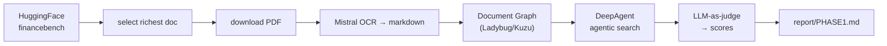

# financebench

Benchmarking a **Document Graph + vectorless agentic search** stack on
[FinanceBench](https://huggingface.co/datasets/PatronusAI/financebench) (Patronus AI).

The stack — built on [genai-tk](https://github.com/tclatos/genai-tk) and
[genai-graph](https://github.com/tclatos/genai-graph) — turns each SEC filing
into a `Folder → Document → MarkdownSection` graph on a Ladybug (Kuzu/Cypher)
database, then a DeepAgent answers financial questions by **navigating** that
graph with read-only tools (`get_folder_toc`, `get_document_toc`,
`get_section_content`, `search_sections`) — no embeddings, no vector store.

## Phase 1 result (single document)

Target: `AMD_2022_10K` (auto-selected: the doc with the most questions, 7).

| Accuracy | Groundedness | Numeric match | Avg tool calls |
|---|---|---|---|
| **6/7 (85.7%)** | **7/7 (100%)** | 1/2 | 6.4 |

Every answer was grounded in source sections (zero hallucinations). The one
failure is a numerical-reasoning error (quick-ratio formula), not a retrieval
failure — see [`report/PHASE1.md`](report/PHASE1.md) for the full diagnostic,
trajectory analysis, and Phase-2 plan.

## Pipeline



## Quick start

```bash
uv sync --extra harnessing        # DeepAgents SDK for the deep agent
just bench                        # load → fetch → OCR/graph → run → grade
```

Prerequisites: a `~/.env` with `HF_TOKEN`, `MISTRAL_API_KEY`,
`OPENROUTER_API_KEY` (and `GITHUB_*` only for pushing). OCR markdown is mirrored
to `$ONEDRIVE/prj/financebench/markdown/`; all other artifacts stay under
`data/` (gitignored).

Individual steps:

```bash
just bench-load      # → data/financebench/questions.jsonl (auto-selects target doc)
just bench-fetch     # → data/pdfs/<doc>.pdf
just bench-build     # Mistral OCR → data/markdown/ → Ladybug Document Graph
just bench-run       # 7 questions through the docgraph agent → runs.jsonl
just bench-grade     # LLM-as-judge → scores.jsonl + scores_summary.json
cli trajectory list  # inspect recorded agent trajectories (ATOF/ATIF export)
```

## Layout

```
financebench/bench/        # bench harness: load_dataset, fetch_pdf, build_graph, run_questions, grade
config/                    # agents.yaml (docgraph profile), knowledge_tree.yaml, markdownize.yaml
skills/custom/financebench-qa/SKILL.md   # financial-statement navigation + answering rules
report/PHASE1.md           # Phase-1 diagnostic + Phase-2 plan
```

## Notes

- `genai-tk` and `genai-graph` are pulled from their git repos (see
  `pyproject.toml`); `genai-graph` is currently an editable local path dep.
- The bench harness calls the Mistral OCR processor and the graph ingestor
  directly (not via Prefect `@flow` wrappers), so it is deterministic and does
  not require a Prefect server.
- Data, DBs, caches, trajectories, and secrets are gitignored; the repo
  contains code, config, skills, the report, and a small markdown sample only.
