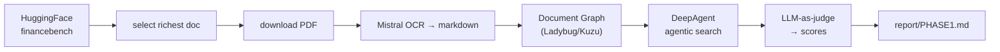

# financebench

Benchmarking a **Document Graph + vectorless agentic search** stack on
[FinanceBench](https://huggingface.co/datasets/PatronusAI/financebench) (Patronus AI).

The stack — built on [genai-tk](https://github.com/tclatos/genai-tk) and
[genai-graph](https://github.com/tclatos/genai-graph) — turns each SEC filing
into a `Folder → Document → MarkdownSection` graph on a Ladybug (Kuzu/Cypher)
database, then a DeepAgent answers financial questions by **navigating** that
graph with read-only tools (`get_folder_toc`, `get_document_toc`,
`get_section_content`, `search_sections`) — no embeddings, no vector store.

## Phase 1 result (single document)

Target: `AMD_2022_10K` (auto-selected: the doc with the most questions, 7).

| Accuracy | Groundedness | Numeric match | Avg tool calls |
|---|---|---|---|
| **6/7 (85.7%)** | **7/7 (100%)** | 1/2 | 6.4 |

Every answer was grounded in source sections (zero hallucinations). The one
failure is a numerical-reasoning error (quick-ratio formula), not a retrieval
failure — see [`report/PHASE1.md`](report/PHASE1.md) for the full diagnostic,
trajectory analysis, and Phase-2 plan.

## Phase 2 result (multi-document)

Three filings answered corpus-wide (`folder_id=None`): Pfizer 10-Q, BestBuy 10-Q,
J&J 8-K (3 questions each, all `novel-generated`). File tools restored so the
skill system works again; new `financial-ratios` skill; config-driven CLI
(`config/bench.yaml` + `financebench/bench.run`).

| Accuracy | Groundedness | Numeric match | Avg tool calls | Avg in tok/q |
|---|---|---|---|---|
| **5/9 (55.6%)** | **7/9 (77.8%)** | 3/5 (60%) | 13.3 | 175,931 |

A sharp regression from Phase 1.3 (85.7% / 100%), concentrated on the two 10-Qs
(J&J 8-K stayed 3/3). Root cause: the agent stops mapping the document TOC and
over-searches by keyword — one Pfizer numeric question alone burned 912k input
tokens (58% of the run). See [`report/PHASE2.md`](report/PHASE2.md) for the
per-question results, failure analysis, cost diagnosis, and the Phase-3 backlog.

## Pipeline



## Quick start

```bash
uv sync --extra harnessing        # DeepAgents SDK for the deep agent
just bench                        # full benchmark run: fetch → OCR/graph → run → grade
```

Prerequisites: a `~/.env` with `HF_TOKEN`, `MISTRAL_API_KEY`,
`OPENROUTER_API_KEY` (and `GITHUB_*` only for pushing). OCR markdown is mirrored
to `$ONEDRIVE/prj/financebench/markdown/`; all other artifacts stay under
`data/` (gitignored).

Individual steps & CLI commands:

```bash
cli bench list       # list configured benchmark profiles
cli bench run        # run active benchmark profile (default: deepseek_flash)
just bench-fetch     # download PDFs only (cli bench run --step fetch)
just bench-build     # build Document Graph (cli bench run --step build)
just bench-run       # run agent over questions (cli bench run --step run)
just bench-grade     # LLM-as-judge evaluation (cli bench run --step grade)
cli trajectory list  # inspect recorded agent trajectories (ATOF/ATIF export)
```

## Layout

```
financebench/bench/        # bench harness: run, build_graph, run_questions, grade, fetch_pdf, load_dataset
financebench/commands/     # CLI commands: bench_commands, agent_commands
config/                    # bench.yaml, app_conf.yaml, agents.yaml, providers/
skills/custom/             # domain skills: financebench-qa, financial-ratios
report/                    # evaluation reports & analysis
```

## Notes

- `genai-tk` and `genai-graph` are pulled from their git repos (see
  `pyproject.toml`); `genai-graph` is currently an editable local path dep.
- The bench harness calls the Mistral OCR processor and the graph ingestor
  directly (not via Prefect `@flow` wrappers), so it is deterministic and does
  not require a Prefect server.
- Data, DBs, caches, trajectories, and secrets are gitignored; the repo
  contains code, config, skills, the report, and a small markdown sample only.
