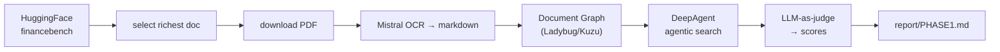

# financebench

Benchmarking a **Document Graph + vectorless agentic search** stack on
[FinanceBench](https://huggingface.co/datasets/PatronusAI/financebench) (Patronus AI).

The stack — built on [genai-tk](https://github.com/tclatos/genai-tk) and
[genai-graph](https://github.com/tclatos/genai-graph) — turns each SEC filing
into a `Folder → Document → MarkdownSection` graph on a Ladybug (Kuzu/Cypher)
database, then a DeepAgent answers financial questions by **navigating** that
graph with read-only tools (`get_folder_toc`, `get_document_toc`,
`get_section_content`, `search_sections`) — no embeddings, no vector store.


## Pipeline



## Quick start

```bash
uv sync --extra harnessing        # DeepAgents SDK for the deep agent
just bench                        # full benchmark run: fetch → OCR/graph → run → grade
```

Prerequisites: a `~/.env` with `HF_TOKEN`, `MISTRAL_API_KEY`,
`OPENROUTER_API_KEY` (and `GITHUB_*` only for pushing). OCR markdown is mirrored
to `$ONEDRIVE/prj/financebench/markdown/`; all other artifacts stay under
`data/` (gitignored).

Individual steps & CLI commands:

```bash
cli bench list       # list configured benchmark profiles
cli bench run        # run active benchmark profile (default: deepseek_flash)
just bench-fetch     # download PDFs only (cli bench run --step fetch)
just bench-build     # build Document Graph (cli bench run --step build)
just bench-run       # run agent over questions (cli bench run --step run)
just bench-grade     # LLM-as-judge evaluation (cli bench run --step grade)
cli trajectory list  # inspect recorded agent trajectories (ATOF/ATIF export)
```

## Layout

```
financebench/bench/        # bench harness: run, build_graph, run_questions, grade, fetch_pdf, load_dataset
financebench/commands/     # CLI commands: bench_commands, agent_commands
config/                    # bench.yaml, app_conf.yaml, agents.yaml, providers/
skills/custom/             # domain skills: financebench-qa, financial-ratios
report/                    # evaluation reports & analysis
```

## Notes

- `genai-tk` and `genai-graph` are pulled from their git repos (see
  `pyproject.toml`); `genai-graph` is currently an editable local path dep.
- The bench harness calls the Mistral OCR processor and the graph ingestor
  directly (not via Prefect `@flow` wrappers), so it is deterministic and does
  not require a Prefect server.
- Data, DBs, caches, trajectories, and secrets are gitignored; the repo
  contains code, config, skills, the report, and a small markdown sample only.
